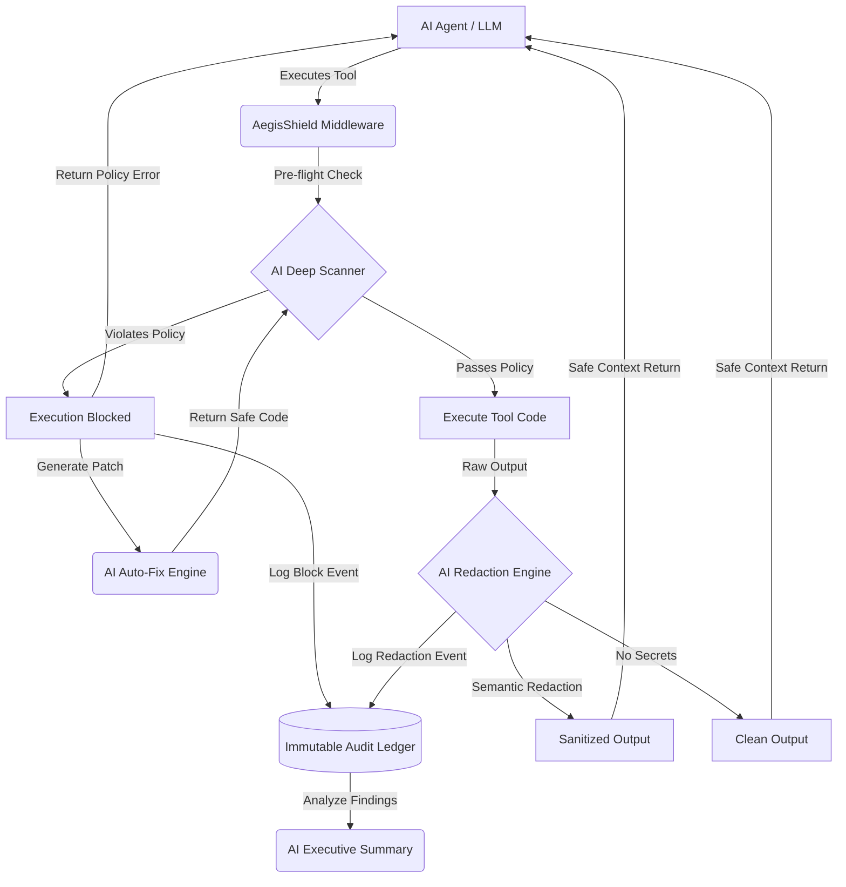

<div align="center">
  

  <h1>AegisShield</h1>
  <p><strong>Enterprise Security Middleware for Agentic AI</strong></p>

  <p>
    <a href="https://github.com/amitwaghmare888/AegisShield/commits/main"></a>
    <a href="https://nextjs.org/"></a>
    
  </p>

  <p>
    <em>Zero-latency supply-chain security, real-time risk scoring, and zero-trust semantic redaction for LLM agent skills.</em>
  </p>

  <p>
    <a href="#why-aegisshield">Why AegisShield?</a> •
    <a href="#core-ai-features">Features</a> •
    <a href="#system-architecture-ai-enhanced">Architecture</a> •
    <a href="#quick-start">Quick Start</a> •
    <a href="#api-reference">API</a>
  </p>
</div>

---

## Why AegisShield?

As AI agents execute third-party "tools" or "skills", they inherently trust external code. These tools often harbor severe security vulnerabilities:
- **Hardcoded API keys** leaked via debug prints.
- **Environment variables** exposed during crash traces.
- **Unsafe network calls** resulting in data exfiltration.

When an agent executes these compromised tools, sensitive output is captured and injected directly into the LLM context window, exposing your production credentials to third-party model providers.

**AegisShield** acts as a bulletproof vest for your LLMs. It audits skills before they run, intercepts their outputs in real-time, and uses **Deep AI Scanning** to neutralize credential leakage and exfiltration *before* the data ever reaches the LLM context window.

---

## Core AI Features

| Feature | Description | Technology |
|---------|-------------|------------|
| **AI Deep Scanner** | Semantically analyzes third-party skills for complex logic flaws and vulnerabilities that standard regex/AST misses. | Gemini 3.5 Flash |
| **AI Auto-Fix Engine** | Generates secure, drop-in code replacements for vulnerable snippets on the fly. | Gemini 3.5 Flash |
| **AI Redaction Engine** | Intercepts tool outputs at runtime, semantically redacting secrets (e.g., `[REDACTED]`) with sub-40ms overhead. | Gemini 3.5 Flash |
| **AI Threat Reporting** | Generates concise, professional executive summaries from the immutable audit ledger. | Gemini 3.5 Flash |

---

## System Architecture (AI-Enhanced)



---

## Quick Start

### Prerequisites
- Node.js 18.17+
- A Gemini API Key (for AI features)

### 1. Installation
```bash
git clone https://github.com/amitwaghmare888/AegisShield.git
cd AegisShield
npm install
```

### 2. Configuration
Create a `.env.local` file in the root directory and add your Gemini API Key:
```env
GEMINI_API_KEY=your_api_key_here
```

### 3. Launch
```bash
npm run dev
```
Open [http://localhost:3000](http://localhost:3000) to access the Pixel-Perfect Enterprise Dashboard.

---

## Usage & Dashboard

1. **Drag & Drop:** Drop any `.py`, `.js`, or `.zip` skill directly into the input zone.
2. **GitHub URL:** Paste a public GitHub repository URL to scan the entire project automatically.
3. **Review Findings:** Examine the risk score and detailed findings, including exact line numbers and evidence snippets.
4. **Apply Fixes:** Click the **Auto-Fix** button to let the AI rewrite the vulnerable code.
5. **Runtime Wrapper:** Test the live redaction engine directly in the UI to witness real-time secret sanitization.

---

## API Reference

Integrate AegisShield directly into your AI agent pipelines.

### `POST /api/wrapper/redact`
Redacts secrets from text before feeding it back to the LLM.

**Request:**
```bash
curl -X POST http://localhost:3000/api/wrapper/redact \
  -H 'Content-Type: application/json' \
  -d '{"text": "DEBUG: API_KEY=dummy_fake_key_1234567890abcdef"}'
```

**Response:**
```json
{
  "output": "DEBUG: API_KEY=[REDACTED by AegisShield]",
  "redactions": 1,
  "output_chars": 40,
  "input_chars": 51
}
```

---

## Technology Stack
- **Framework:** [Next.js 16](https://nextjs.org/) (App Router)
- **Styling:** [Tailwind CSS 4](https://tailwindcss.com/) + Custom Enterprise Design System
- **Animations:** HTML5 Canvas (GPU-efficient sprites), CSS Animations, Intersection Observer
- **Fonts:** Inter & JetBrains Mono

