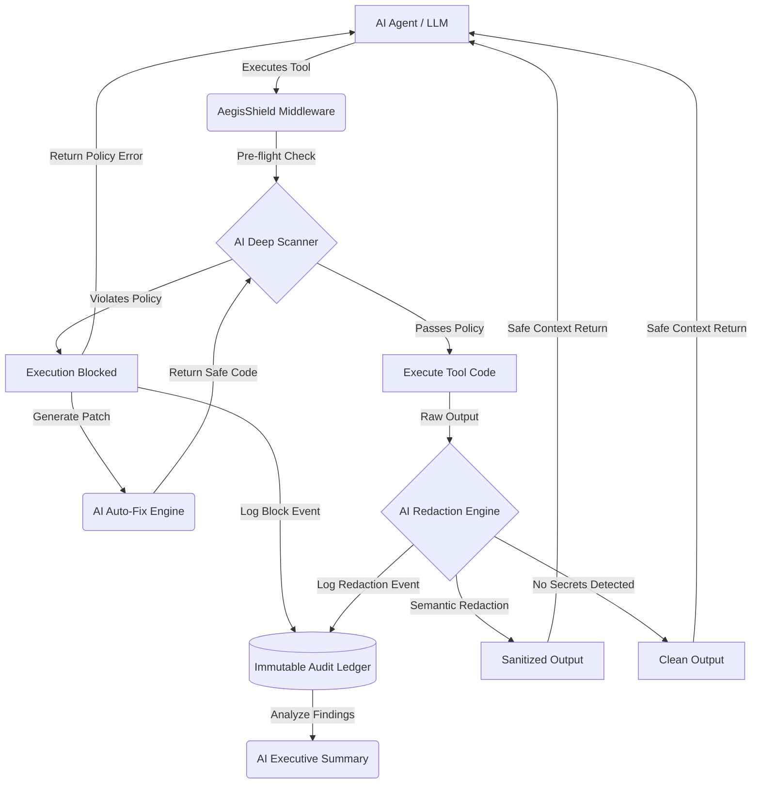

<div align="center">
  

  <h1>AegisShield</h1>

  <p><strong>Enterprise-Grade AI Security Middleware for Agentic LLM Pipelines</strong></p>

  <p>
    <a href="https://aegis-shield-63vqyi3j7-amitwaghmare-s-projects.vercel.app/"></a>
    <a href="https://github.com/amitwaghmare888/AegisShield/commits/main"></a>
    
    
    
    
  </p>

  <p>
    <a href="https://aegis-shield-63vqyi3j7-amitwaghmare-s-projects.vercel.app/">Live Demo</a> &nbsp;|&nbsp;
    <a href="#problem-statement">Problem</a> &nbsp;|&nbsp;
    <a href="#core-capabilities">Features</a> &nbsp;|&nbsp;
    <a href="#system-architecture">Architecture</a> &nbsp;|&nbsp;
    <a href="#quick-start">Quick Start</a> &nbsp;|&nbsp;
    <a href="#api-reference">API</a>
  </p>
</div>

---

## Problem Statement

Modern AI agents execute third-party tools and skills to accomplish tasks. These external code packages routinely contain severe security vulnerabilities that expose production systems to credential leakage and data exfiltration:

- **Hardcoded API keys** silently leaked through debug print statements
- **Environment variables** exposed via crash traces and error outputs
- **Unsafe network calls** enabling real-time data exfiltration to adversary servers
- **Logic-level backdoors** that regex and AST analysis cannot detect

When an AI agent executes a compromised skill, its raw output flows directly into the LLM context window — handing your production credentials and sensitive data to a third-party model provider. Standard static analyzers miss the semantic-level threats that exist in dynamically composed agentic pipelines.

**AegisShield** is the security layer that sits between the AI agent and the tools it runs. It intercepts, audits, and sanitizes at every stage — before execution, during output capture, and at the point of context injection — with zero architectural changes to the agent itself.

---

## Live Demo

**[aegis-shield-63vqyi3j7-amitwaghmare-s-projects.vercel.app](https://aegis-shield-63vqyi3j7-amitwaghmare-s-projects.vercel.app/)**

Drop any Python, JavaScript, or ZIP file onto the dashboard, paste a public GitHub repository URL, and AegisShield returns a full risk score, categorized findings with exact line numbers, AI-generated patches, and an executive threat summary — all in under a few seconds.

---

## Core Capabilities

### Multi-Layer Scanning Engine

AegisShield runs three independent analysis passes on every skill submitted for review:

| Layer | Method | Detects |
|-------|--------|---------|
| Static Pattern Analysis | Regex-based rule engine | Hardcoded secrets, known dangerous API patterns |
| AST Analysis | Abstract Syntax Tree parsing | Unsafe function calls, dynamic code execution, network sinks |
| AI Semantic Scan | LLM reasoning over source | Context-aware logic flaws, obfuscated exfiltration, intent-level threats |

### AI-Powered Security Features

| Feature | Description | Model |
|---------|-------------|-------|
| **Semantic Vulnerability Intelligence** | Goes beyond pattern matching — reasons over raw source code semantically to surface intent-level threats, obfuscated logic flaws, and supply-chain backdoors that regex and AST analysis cannot reach. Returns structured findings with per-finding confidence scores. | `gemini-3.5-flash` |
| **Autonomous Code Remediation** | On demand, synthesizes drop-in secure code replacements for every flagged vulnerability. Each patch is context-aware, production-safe, and immediately applicable — no manual rewrite required. | `gemini-3.5-flash` |
| **Zero-Trust Context Sanitization** | Intercepts raw tool output at the API boundary before it enters the LLM context window, semantically identifying and redacting credentials, tokens, and PII in real time with sub-40ms latency overhead. | `gemini-3.5-flash` |
| **Executive Threat Intelligence Synthesis** | Aggregates findings across all detection layers — static, AST, and semantic — and produces a concise, structured executive summary ready for security incident reporting, compliance review, or stakeholder briefing. | `gemini-3.5-flash` |

### Risk Scoring and Audit Trail

Every scan produces a deterministic 0–100 risk score weighted by finding severity. All events — blocks, redactions, fixes — are written to an immutable in-session audit ledger that can be exported as a structured JSON report via the dashboard or the keyboard shortcut `Ctrl+E`.

---

## System Architecture



The middleware is fully stateless per request. There is no persistent storage of user code. Audit logs exist only within the active session and are exportable on demand.

---

## Quick Start

### Prerequisites

- Node.js 18.17 or later
- A Gemini API key (`GEMINI_API_KEY`) — obtain one at [aistudio.google.com](https://aistudio.google.com/)

### Installation

```bash
git clone https://github.com/amitwaghmare888/AegisShield.git
cd AegisShield
npm install
```

### Configuration

Create a `.env.local` file in the project root:

```env
GEMINI_API_KEY=your_api_key_here
```

### Development Server

```bash
npm run dev
```

Open [http://localhost:3000](http://localhost:3000) to access the dashboard.

---

## Usage

### Scanning a Skill

**Via file upload:** Drag and drop any `.py`, `.js`, `.ts`, or `.zip` archive into the upload zone. Files up to 25 MB are supported. ZIP archives are recursively unpacked and all source files are scanned as a single project.

**Via GitHub URL:** Paste any public GitHub repository URL into the scan input. AegisShield clones the repository, walks the file tree, and scans all source files in a single pass.

### Reading Results

After a scan completes, the dashboard renders:

- A **risk gauge** showing the weighted 0–100 score
- **Finding cards** grouped by severity (Critical, High, Warning, Info), each with the exact file path, line number, and code snippet
- A **source badge** indicating whether the finding came from the static engine, AST parser, or AI reasoning layer

### AI Actions

From the findings panel, three AI actions are available:

1. **Run AI Deep Scan** — sends the full source to the AI for a semantic pass and appends any additional findings to the result set
2. **Auto-Fix** — generates a safe code patch for an individual finding inline
3. **Generate Threat Summary** — produces an executive-level summary across all findings for the current scan

### Runtime Redaction

The **Wrapper** panel (accessible via the dashboard or `Ctrl+Shift+W`) provides a live sandbox for the redaction engine. Paste any text — logs, API responses, debug output — and the AI engine returns a sanitized version with all detected secrets replaced by `[REDACTED]`, along with a count of redactions and round-trip latency.

---

## API Reference

AegisShield exposes a REST API for direct integration into existing AI agent pipelines.

### POST /api/wrapper/redact

Redacts secrets from arbitrary text before it enters the LLM context window.

**Request**

```bash
curl -X POST https://your-deployment.vercel.app/api/wrapper/redact \
  -H 'Content-Type: application/json' \
  -d '{"text": "DEBUG: API_KEY=sk-live-abc123xyz456"}'
```

**Response**

```json
{
  "output": "DEBUG: API_KEY=[REDACTED by AegisShield]",
  "redactions": 1,
  "output_chars": 42,
  "input_chars": 34
}
```

### POST /api/scan/file

Accepts a multipart file upload and returns a full scan result payload.

**Request**

```bash
curl -X POST https://your-deployment.vercel.app/api/scan/file \
  -F 'file=@./agent_tool.py'
```

**Response**

```json
{
  "scan_id": "sc_1a2b3c",
  "risk_score": 87,
  "severity": "Critical",
  "files_scanned": 1,
  "duration_ms": 240,
  "findings": [
    {
      "id": "HARDCODED_SECRET_001",
      "category": "Credential Exposure",
      "severity": "critical",
      "source": "static",
      "file": "agent_tool.py",
      "line": 14,
      "snippet": "API_KEY = \"sk-live-abc123xyz456\"",
      "message": "Hardcoded API key detected. Credentials embedded in source code will be exposed in version control and LLM context.",
      "suggested_fix": "Use environment variables: API_KEY = os.getenv('API_KEY')"
    }
  ]
}
```

### POST /api/scan/url

Clones a public GitHub repository and returns a scan result across all source files.

**Request**

```bash
curl -X POST https://your-deployment.vercel.app/api/scan/url \
  -H 'Content-Type: application/json' \
  -d '{"url": "https://github.com/example/some-agent-skill"}'
```

### POST /api/ai/fix

Generates a secure code patch for a specific finding.

### POST /api/ai/scan

Runs the AI semantic analysis pass over raw source code.

### POST /api/ai/redact

AI-powered redaction with semantic context understanding (as opposed to the regex-based `/api/wrapper/redact` endpoint).

### POST /api/ai/summary

Generates an executive threat summary from a set of findings.

---

## Keyboard Shortcuts

| Shortcut | Action |
|----------|--------|
| `Ctrl + K` | Focus the GitHub URL scan input |
| `Ctrl + Shift + W` | Open the Runtime Wrapper panel |
| `Ctrl + E` | Export the current audit report as JSON |
| `Escape` | Close any open modal |

---

## Technology Stack

| Layer | Technology |
|-------|-----------|
| Framework | Next.js 16 (App Router) with React 19 |
| Language | TypeScript 5 |
| AI Model | `gemini-3.5-flash` via `@google/generative-ai` SDK |
| Styling | Tailwind CSS 4 with a custom enterprise design system |
| Rendering | Client-side React with server-side API routes |
| Animations | HTML5 Canvas (GPU-efficient sprite rendering), CSS animations, Intersection Observer API |
| Typography | Inter, JetBrains Mono |
| Deployment | Vercel (Edge Network) |

---

## Project Structure

```
AegisShield/
├── app/
│   ├── api/
│   │   ├── ai/          # AI feature endpoints (fix, scan, redact, summary)
│   │   ├── scan/        # File and URL scan endpoints
│   │   └── wrapper/     # Runtime redaction endpoint
│   ├── globals.css      # Enterprise design system and component styles
│   ├── layout.tsx       # Root layout with metadata
│   └── page.tsx         # Main dashboard (single-page application)
├── aegis-scanner/       # Core static + AST scanning engine
├── aegis-scanner-ai/    # AI scan orchestration layer
├── lib/                 # Shared utilities
└── public/              # Static assets
```

---

## Security and Privacy

- No user-submitted code is persisted to any database or external service
- All processing occurs within the serverless function execution context
- Audit logs are session-scoped and exportable only by the user who generated them
- API keys are never logged and are read exclusively from server-side environment variables

---

## Author

**Amit Waghmare**
[GitHub](https://github.com/amitwaghmare888)
