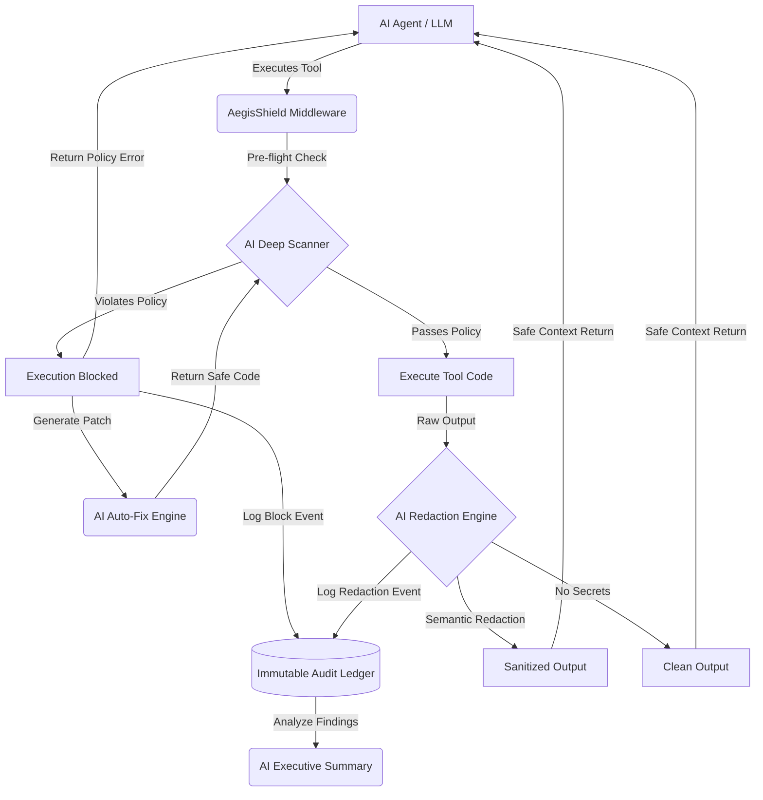

<div align="center">
  
  <h1>AegisShield</h1>
  <p><strong>Enterprise Security Middleware for Agentic AI</strong></p>
  <p>Runtime supply-chain security with real-time risk scores and redaction for third-party agent skills.</p>

  <p>
    <a href="#features">Features</a> •
    <a href="#getting-started">Getting Started</a> •
    <a href="#usage">Usage</a> •
    <a href="#api-reference">API</a>
  </p>
</div>

---

## 🛡️ Overview

Agentic AI systems frequently execute third-party "tools" or "skills." These tools often contain security vulnerabilities, such as hardcoded API keys, debug prints leaking environment variables, or unsafe network calls. When an agent executes these tools, the sensitive output is captured and injected into the LLM’s context history, exposing production credentials to third-party model providers.

**AegisShield** is a production-grade security auditing and runtime protection layer designed specifically to neutralize the risk of credential leakage and data exfiltration before they reach the LLM context window.

## ✨ Features

- **Pre-Install Auditor:** Static regex and AST passes detect debug prints leaking env vars, hard-coded credentials, wallet keys, and unsafe network/subprocess calls.
- **Real-Time Wrapper & Redaction:** Intercepts tool outputs at runtime, redacting secrets (e.g., `[REDACTED by AegisShield]`) before they reach the model context. Sub-40ms overhead.
- **Governance & Compliance:** Maps findings to governance policies, enforcing org-wide allowlists with an audit-ready ledger.
- **Scan History Dashboard:** Persistent local history with risk trend sparklines.
- **Export Audit Reports:** Download compliance-ready JSON audit trails.
- **Pixel-Perfect UI:** High-density enterprise SaaS dashboard with canvas-based constellation animations and SVG risk gauges.

## 🧠 System Architecture (AI-Enhanced)



## 🚀 Getting Started

### Prerequisites

- Node.js 18.17 or later
- npm, yarn, or pnpm

### Installation

1. Clone the repository:
   ```bash
   git clone https://github.com/yourusername/aegis-scanner.git
   cd aegis-scanner
   ```

2. Install dependencies:
   ```bash
   npm install
   ```

3. Run the development server:
   ```bash
   npm run dev
   ```

4. Open [http://localhost:3000](http://localhost:3000) with your browser to see the result.

## 💻 Usage

### Dashboard

The main dashboard provides an intuitive interface for scanning skills:
1. **Drag & Drop:** Drop a `.py`, `.js`, or `.zip` file directly into the input zone.
2. **GitHub URL:** Paste a public GitHub repository URL to scan the entire project automatically.
3. **Review Findings:** Examine the risk score and detailed findings, including exact line numbers, evidence snippets, and suggested fixes.

### Runtime Wrapper Modal

Test the live redaction engine directly in the UI:
1. Click **Apply Wrapper**.
2. Paste any simulated tool output containing secrets (or click **Load from scan**).
3. Click **Run wrapper** to see the redacted output and performance metrics.

## 🔌 API Reference

Integrate AegisShield directly into your AI agent pipelines.

### `POST /api/wrapper/redact`

Redacts secrets from text before feeding it back to the LLM.

**Request:**
```bash
curl -X POST http://localhost:3000/api/wrapper/redact \
  -H 'Content-Type: application/json' \
  -d '{"text": "DEBUG: API_KEY=dummy_fake_key_1234567890abcdef"}'
```

**Response:**
```json
{
  "output": "DEBUG: API_KEY=[REDACTED by AegisShield]",
  "redactions": 1,
  "output_chars": 40,
  "input_chars": 51
}
```

### `POST /api/scan/file`

Scan a file upload (multipart/form-data).

### `POST /api/scan/url`

Scan a public GitHub repository.
```json
{
  "url": "https://github.com/owner/repo"
}
```

## 🛠️ Technology Stack

- **Framework:** [Next.js 16](https://nextjs.org/) (App Router)
- **Styling:** [Tailwind CSS 4](https://tailwindcss.com/) + Custom Design System
- **Animations:** HTML5 Canvas (GPU-efficient sprites), CSS Animations, Intersection Observer
- **Fonts:** Inter & JetBrains Mono

## 📄 License

This project is licensed under the MIT License - see the [LICENSE](LICENSE) file for details.
